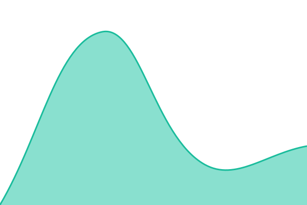

# [📈 Live Status](https://dreamersmarkets.github.io/status): <!--live status--> **🟩 All systems operational**

This repository contains the open-source uptime monitor and status page for [DM](https://dreamersmarkets.github.io/status), powered by [Upptime](https://github.com/upptime/upptime).

With [Upptime](https://upptime.js.org), you can get your own unlimited and free uptime monitor and status page, powered entirely by a GitHub repository. We use [Issues](https://github.com/dreamersmarkets/status/issues) as incident reports, [Actions](https://github.com/dreamersmarkets/status/actions) as uptime monitors, and [Pages](https://dreamersmarkets.github.io/status) for the status page.

<!--start: status pages-->
<!-- This summary is generated by Upptime (https://github.com/upptime/upptime) -->
<!-- Do not edit this manually, your changes will be overwritten -->
<!-- prettier-ignore -->
| URL | Status | History | Response Time | Uptime |
| --- | ------ | ------- | ------------- | ------ |
|  [Pastaphony - website](https://www.pastaphony.com) | 🟩 Up | [pastaphony-website.yml](https://github.com/dreamersmarkets/status/commits/HEAD/history/pastaphony-website.yml) | 

 212ms
     
 | 

<a href="https://dreamersmarkets.github.io/status/history/pastaphony-website">100.00%</a>
    

|  [Pastaphony - API](https://pastaphony-api.vercel.app) | 🟩 Up | [pastaphony-api.yml](https://github.com/dreamersmarkets/status/commits/HEAD/history/pastaphony-api.yml) | 

 142ms
     
 | 

<a href="https://dreamersmarkets.github.io/status/history/pastaphony-api">100.00%</a>
    

|  [OniGuru - website](https://www.onigururestaurant.com) | 🟩 Up | [oni-guru-website.yml](https://github.com/dreamersmarkets/status/commits/HEAD/history/oni-guru-website.yml) | 

 213ms
     
 | 

<a href="https://dreamersmarkets.github.io/status/history/oni-guru-website">100.00%</a>
    

|  [OniGuru - API](https://oniguru-api.vercel.app) | 🟩 Up | [oni-guru-api.yml](https://github.com/dreamersmarkets/status/commits/HEAD/history/oni-guru-api.yml) | 

 191ms
     
 | 

<a href="https://dreamersmarkets.github.io/status/history/oni-guru-api">100.00%</a>
    

|  [OniGuru - legacy site (old.)](https://old.onigururestaurant.com) | 🟩 Up | [oni-guru-legacy-site-old.yml](https://github.com/dreamersmarkets/status/commits/HEAD/history/oni-guru-legacy-site-old.yml) | 

 245ms
     
 | 

<a href="https://dreamersmarkets.github.io/status/history/oni-guru-legacy-site-old">100.00%</a>
    

|  [Dreamers Markets - website](https://www.dreamersmarkets.com) | 🟩 Up | [dreamers-markets-website.yml](https://github.com/dreamersmarkets/status/commits/HEAD/history/dreamers-markets-website.yml) | 

 243ms
     
 | 

<a href="https://dreamersmarkets.github.io/status/history/dreamers-markets-website">100.00%</a>
    

|  [Dreamers Markets - vendor intake (Wix)](https://dm.dreamersmarkets.com) | 🟩 Up | [dreamers-markets-vendor-intake-wix.yml](https://github.com/dreamersmarkets/status/commits/HEAD/history/dreamers-markets-vendor-intake-wix.yml) | 

 240ms
     
 | 

<a href="https://dreamersmarkets.github.io/status/history/dreamers-markets-vendor-intake-wix">100.00%</a>
    

|  [Dreamers Marketplace - storefront](https://shop.dreamersmarkets.com) | 🟩 Up | [dreamers-marketplace-storefront.yml](https://github.com/dreamersmarkets/status/commits/HEAD/history/dreamers-marketplace-storefront.yml) | 

 2065ms
     
 | 

<a href="https://dreamersmarkets.github.io/status/history/dreamers-marketplace-storefront">100.00%</a>
    

|  [Dreamers - shop portal](https://shopportal.dreamersmarkets.com) | 🟩 Up | [dreamers-shop-portal.yml](https://github.com/dreamersmarkets/status/commits/HEAD/history/dreamers-shop-portal.yml) | 

 2325ms
     
 | 

<a href="https://dreamersmarkets.github.io/status/history/dreamers-shop-portal">100.00%</a>
    

|  [Dreamers - portal cron fleet](https://portal.dreamersmarkets.com/api/cron-liveness) | 🟩 Up | [dreamers-portal-cron-fleet.yml](https://github.com/dreamersmarkets/status/commits/HEAD/history/dreamers-portal-cron-fleet.yml) | 

 333ms
     
 | 

<a href="https://dreamersmarkets.github.io/status/history/dreamers-portal-cron-fleet">21.11%</a>
    

|  [Grandpa Coffee Bar - website](https://grandpacoffeebar.com) | 🟩 Up | [grandpa-coffee-bar-website.yml](https://github.com/dreamersmarkets/status/commits/HEAD/history/grandpa-coffee-bar-website.yml) | 

 489ms
     
 | 

<a href="https://dreamersmarkets.github.io/status/history/grandpa-coffee-bar-website">100.00%</a>
    

|  [Pastaphony - Anaheim storefront](https://pastaphonyanaheim.square.site) | 🟩 Up | [pastaphony-anaheim-storefront.yml](https://github.com/dreamersmarkets/status/commits/HEAD/history/pastaphony-anaheim-storefront.yml) | 

 1014ms
     
 | 

<a href="https://dreamersmarkets.github.io/status/history/pastaphony-anaheim-storefront">100.00%</a>
    

|  [Pastaphony - Carlsbad storefront](https://pastaphonycarlsbad.square.site) | 🟩 Up | [pastaphony-carlsbad-storefront.yml](https://github.com/dreamersmarkets/status/commits/HEAD/history/pastaphony-carlsbad-storefront.yml) | 

 332ms
     
 | 

<a href="https://dreamersmarkets.github.io/status/history/pastaphony-carlsbad-storefront">100.00%</a>
    

|  [Pastaphony - Fullerton storefront](https://pastaphonyfullerton.square.site) | 🟩 Up | [pastaphony-fullerton-storefront.yml](https://github.com/dreamersmarkets/status/commits/HEAD/history/pastaphony-fullerton-storefront.yml) | 

 886ms
     
 | 

<a href="https://dreamersmarkets.github.io/status/history/pastaphony-fullerton-storefront">100.00%</a>
    

|  [Pastaphony - Glendora storefront](https://pastaphonyglendora.square.site) | 🟩 Up | [pastaphony-glendora-storefront.yml](https://github.com/dreamersmarkets/status/commits/HEAD/history/pastaphony-glendora-storefront.yml) | 

 1048ms
     
 | 

<a href="https://dreamersmarkets.github.io/status/history/pastaphony-glendora-storefront">100.00%</a>
    

|  [Pastaphony - Long Beach storefront](https://pastaphonylongbeach.square.site) | 🟩 Up | [pastaphony-long-beach-storefront.yml](https://github.com/dreamersmarkets/status/commits/HEAD/history/pastaphony-long-beach-storefront.yml) | 

 261ms
     
 | 

<a href="https://dreamersmarkets.github.io/status/history/pastaphony-long-beach-storefront">100.00%</a>
    

|  [Pastaphony - Rodeo 39 storefront](https://pastaphonyrodeo39.square.site) | 🟩 Up | [pastaphony-rodeo-39-storefront.yml](https://github.com/dreamersmarkets/status/commits/HEAD/history/pastaphony-rodeo-39-storefront.yml) | 

 384ms
     
 | 

<a href="https://dreamersmarkets.github.io/status/history/pastaphony-rodeo-39-storefront">100.00%</a>
    

|  [Pastaphony - Tustin storefront](https://pastaphonytustin.square.site) | 🟩 Up | [pastaphony-tustin-storefront.yml](https://github.com/dreamersmarkets/status/commits/HEAD/history/pastaphony-tustin-storefront.yml) | 

 346ms
     
 | 

<a href="https://dreamersmarkets.github.io/status/history/pastaphony-tustin-storefront">100.00%</a>
    

|  [Pastaphony - Huntington Beach storefront (coming soon)](https://pastaphonyhb.square.site) | 🟩 Up | [pastaphony-huntington-beach-storefront-coming-soon.yml](https://github.com/dreamersmarkets/status/commits/HEAD/history/pastaphony-huntington-beach-storefront-coming-soon.yml) | 

 607ms
     
 | 

<a href="https://dreamersmarkets.github.io/status/history/pastaphony-huntington-beach-storefront-coming-soon">100.00%</a>
    

|  [OniGuru - Garden Grove storefront](https://oniguru-gardengrove.square.site) | 🟩 Up | [oni-guru-garden-grove-storefront.yml](https://github.com/dreamersmarkets/status/commits/HEAD/history/oni-guru-garden-grove-storefront.yml) | 

 343ms
     
 | 

<a href="https://dreamersmarkets.github.io/status/history/oni-guru-garden-grove-storefront">100.00%</a>
    

|  [OniGuru - Mission Viejo storefront](https://oniguru-missionviejo.square.site) | 🟩 Up | [oni-guru-mission-viejo-storefront.yml](https://github.com/dreamersmarkets/status/commits/HEAD/history/oni-guru-mission-viejo-storefront.yml) | 

 519ms
     
 | 

<a href="https://dreamersmarkets.github.io/status/history/oni-guru-mission-viejo-storefront">100.00%</a>
    

|  [OniGuru - Ladera Ranch storefront (arcek)](https://www.arcekrestaurants.com) | 🟩 Up | [oni-guru-ladera-ranch-storefront-arcek.yml](https://github.com/dreamersmarkets/status/commits/HEAD/history/oni-guru-ladera-ranch-storefront-arcek.yml) | 

 546ms
     
 | 

<a href="https://dreamersmarkets.github.io/status/history/oni-guru-ladera-ranch-storefront-arcek">100.00%</a>
    

|  [Grandpa Coffee Bar - storefront](https://grandpacoffeelb.square.site) | 🟩 Up | [grandpa-coffee-bar-storefront.yml](https://github.com/dreamersmarkets/status/commits/HEAD/history/grandpa-coffee-bar-storefront.yml) | 

 749ms
     
 | 

<a href="https://dreamersmarkets.github.io/status/history/grandpa-coffee-bar-storefront">100.00%</a>
    

<!--end: status pages-->

[**Visit our status website →**](https://dreamersmarkets.github.io/status)

## 📄 License

- Powered by: [Upptime](https://github.com/upptime/upptime)
- Code: [MIT](./LICENSE) © [Anand Chowdhary](https://anandchowdhary.com)
- Data in the `./history` directory: [Open Database License](https://opendatacommons.org/licenses/odbl/1-0/)
